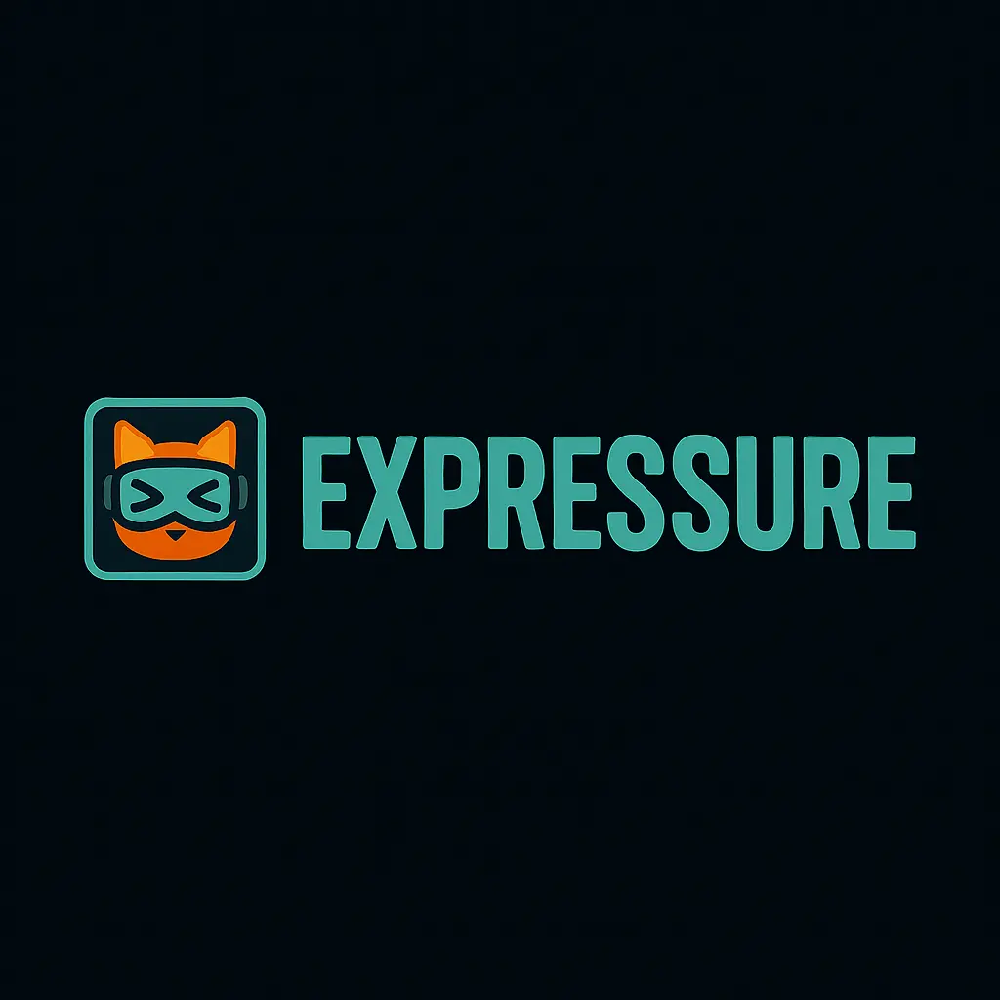
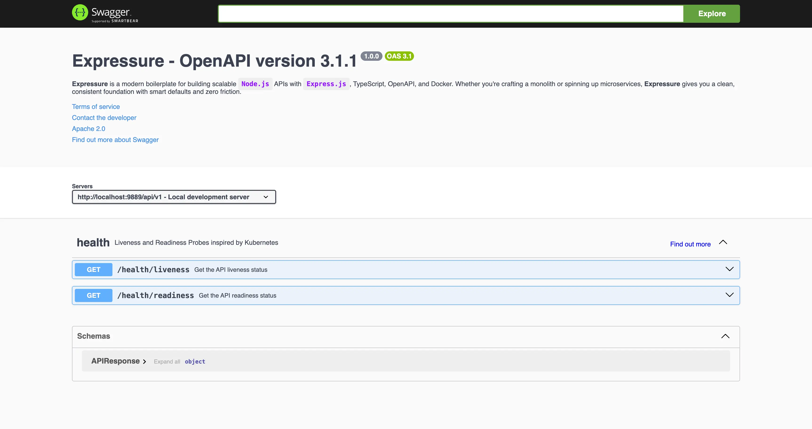

<div align="center">
  
  <h1>Expressure</h1>
  <p>
    <b>A modern, production-ready boilerplate for building scalable Node.js APIs.</b>
  </p>
  <p>
    
    
    
    
    <br/>
    
    
  </p>
</div>

---

## 📖 Overview

**Expressure** is a robust and opinionated boilerplate designed to streamline
the development of scalable `Node.js` APIs. Built with **Express.js 5**,
**TypeScript**, and **OpenAPI 3**, it provides a solid foundation for both
monolithic applications and microservices.

We've handled the heavy lifting—configuration, structure, and tooling—so you can
focus on building features with zero friction.

## ✨ Key Features

- **🚀 Modern Stack**: Built on Express.js 5 and Node.js 20+.
- **💪 Type-Safe**: Full TypeScript support for robust and maintainable code.
- **📄 OpenAPI 3 First**: API-first design with auto-generated Swagger
  documentation.
- **🐳 Docker Ready**: Pre-configured `Dockerfile` and `docker-compose` for
  seamless containerization.
- **🛡️ Secure**: Integrated `Helmet` for security headers and `Cors`
  configuration.
- **📝 Logging**: High-performance logging with `Pino`.
- **🧪 Testing**: Comprehensive testing setup with `Jest`.
- **🧹 Code Quality**: Linting and formatting with `ESLint`, `Prettier`, and
  `Husky` hooks.
- **⚙️ Configurable**: Environment-based configuration management.

## 🛠️ System Requirements

Before you begin, ensure you have the following installed:

- **Node.js**: v20.x or higher
- **PNPM**: v10.23.0 or higher (Recommended package manager)
- **Docker**: v27.x or higher (Optional, but recommended for containerization)

## 🚀 Getting Started

### 1. Clone the Repository

```bash
git clone git@github.com:vihuvac/expressure.git
cd expressure
```

### 2. Configure Environment

Set up your environment variables by copying the template:

```bash
cp .env.template .env
```

> **IMPORTANT**
>
> Ensure `NODE_ENV` is set to `development` for local work. Adjust other
> settings in `.env` or `config/development.json` as needed.

### 3. Install Dependencies

```bash
pnpm install --frozen-lockfile
```

### 4. Run the Application

#### Development Mode

Starts the application with hot-reloading.

```bash
pnpm dev
```

#### Debug Mode

Runs the app with inspection enabled on port 9888.

```bash
pnpm debug
```

#### Production Build

Builds and starts the compiled JavaScript application.

```bash
pnpm build
pnpm start
```

## 🐳 Docker Support

Expressure comes with first-class Docker support.

### Start with Docker Compose

```bash
pnpm docker:up
# OR
docker compose up -d
```

This will start the API and detach it to the background.

### View Logs

```bash
docker logs -f expressure
```

### Stop Containers

```bash
pnpm docker:down
```

## 📚 API Documentation

When the application is running (in non-production environments), you can access
the interactive API documentation via Swagger UI.

**URL**: `http://localhost:9889/api/docs`



Generate comprehensive technical documentation from your code comments using
JSDoc. Documentation is automatically versioned and saved to the `docs`
directory.

```bash
pnpm docs:generate
```


## 📂 Project Structure

```text
src/
├── app/
│   ├── constants/    # Global constants and enums
│   ├── controllers/  # Route controllers (request handlers)
│   ├── helpers/      # Utility functions and helpers
│   ├── libs/         # Third-party library wrappers/configurations
│   ├── middlewares/  # Express middlewares
│   ├── specs/        # OpenAPI specifications
│   └── app.ts        # App entry point and configuration
├── tests/            # Unit and integration tests
└── app.ts            # Main entry file
```

## 🧪 Running Tests

Ensure your code is reliable by running the test suite.

```bash
# Run all tests
pnpm test

# Run tests in watch mode
pnpm test:debug

# Generate coverage report
pnpm test:coverage
```

## 🤝 Contributing

Contributions are welcome! Check out the
[Contribution Guide](./CONTRIBUTING.md).

## 📄 License

This project is licensed under the **MIT License**. See the [LICENSE](./LICENSE)
file for more details.

## Additional Resources

- [Changelog](./CHANGELOG.md)
- [JSDoc](https://github.com/jsdoc/jsdoc)
- [OpenAPI Specification v3](https://swagger.io/specification/v3/)
- [swagger-client](https://github.com/swagger-api/swagger-js)
- [swagger-ui-express](https://github.com/scottie1984/swagger-ui-express)
